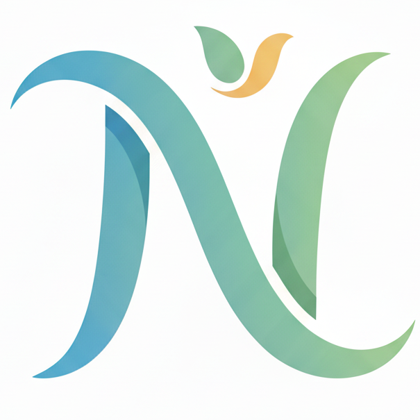

# 🧠 Nivaan — Mental Wellness Platform for Students

 ## ✨ Project Overview

🚀 Smart India Hackathon 2025 Project

**Nivaan** (meaning 'salvation' or 'relief' in Sanskrit) is a web-based mental wellness platform built to help high school students manage stress, emotions, and daily challenges in a simple and practical way.
The goal of this project is to provide easy-to-use tools that students can actually use in their daily life. Not just information, but real support.


## 💡 The Problem Nivaan Solves

High school is a critical period filled with academic stress, social pressures, identity formation, and future anxieties. Many students struggle silently with mental health issues due to stigma, lack of awareness, and limited access to resources. Nivaan addresses this by:

* **Breaking the Stigma:** Offering a normalized and engaging space for mental health discussions.
* **Early Intervention:** Providing tools and resources for self-assessment and coping strategies.
* **Accessibility:** Making mental wellness support available anytime, anywhere via a web platform.
* **Empowerment:** Equipping students with knowledge and techniques to manage their own mental health proactively.

## 🚀 Features

Nivaan is packed with features designed to support high school students:

* 📊 **Mood Tracker** : 
Helps users monitor their emotional patterns over time
* 🧘 **Breathing & Relaxation Exercises** : 
Quick activities to reduce stress instantly
* 📓 **Journaling Prompts** : 
Encourages self-reflection and emotional clarity
* 📚 **Curated Resources** : 
Articles and content relevant to student mental health
* 🎯 **Habit Builder** : 
Helps in building positive daily routines
* ⚡ **Quick Stress Relief Tools** : 
Instant tools for calming the mind

## 🛠️ Technology Stack

Nivaan is built with robust and modern technologies to ensure scalability, performance, and a great user experience.

* **Frontend:** [Next.js](https://nextjs.org/) (React Framework)
* **Styling:** [Tailwind CSS](https://tailwindcss.com/) 
* **Language:** JavaScript
* **Deployment:** Vercel

## 📁 Project Structure

├── public/                 # Static assets (images, favicon, etc.)
│   └── favicon.png         # Nivaan Logo
├── app/                    # Next.js 13 App Router pages and components
│   ├── layout.js           # Root layout for the application
│   ├── page.js             # Home page
├── components/             # Reusable React component
├── Header/                 # Reusable Header Component
├── Footer/                 # Reusable Footer Component
├── next.config.js          # Next.js configuration
├── package.json            # Project dependencies and scripts
├── .env.local              # Environment variables (not committed)
├── .gitignore              # Files/folders ignored by Git
└── README.md               # You are here!

## 🚀 Getting Started

Follow these instructions to set up and run Nivaan locally.

### Prerequisites

Make sure you have the following installed:

* [Node.js](https://nodejs.org/en/download/) (v16.x or higher recommended)
* [npm](https://www.npmjs.com/get-npm) or [Yarn](https://classic.yarnpkg.com/en/docs/install/)

### Installation

1.  **Clone the repository:**
    ```bash
    git clone [https://github.com/YOUR_GITHUB_USERNAME/nivaan-mental-health.git](https://github.com/YOUR_GITHUB_USERNAME/nivaan-mental-health.git)
    cd nivaan-mental-health
    ```
    (Replace `YOUR_GITHUB_USERNAME` and `nivaan-mental-health` with your actual repo details)

2.  **Install dependencies:**
    ```bash
    npm install
    # OR
    yarn install
    ```

3.  **Set up Environment Variables (if any):**
    Create a `.env.local` file in the root of your project based on a `.env.example` (if provided) and fill in any necessary API keys or configurations.
    ```
    # Example .env.local
    # NEXT_PUBLIC_API_URL=http://localhost:3001/api
    ```

### Running the Development Server

1.  **Start the Next.js development server:**
    ```bash
    npm run dev
    # OR
    yarn dev
    ```

2.  Open [http://localhost:3000](http://localhost:3000) in your browser to see the application.

## 🤝 Contribution

This project was developed as part of the Smart India Hackathon. While currently a hackathon submission, contributions and suggestions for improvement are welcome\!

## 📄 License

This project is designed and developed by team Lorem Ipsum.

## 👥 Team Members

-  [Harsh Hatela](https://github.com/harshhatela)
-  [Anas Ali](https://github.com/syAnasali)
-  Contributors — Team Support  

---

**Nivaan: Empowering high school students to navigate their mental health journey with confidence and support.**
